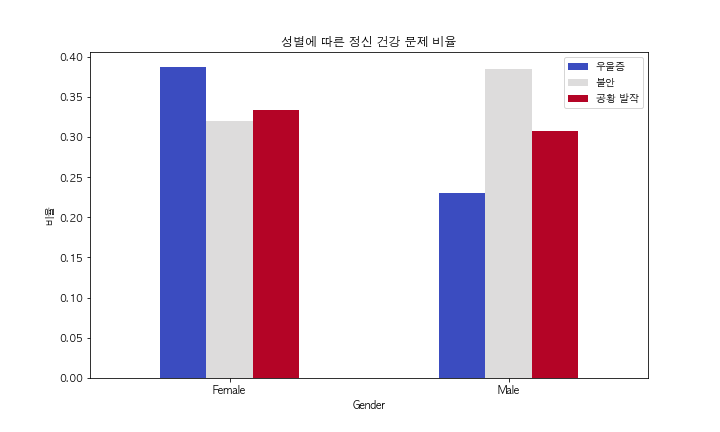
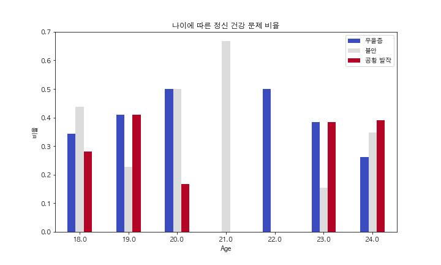
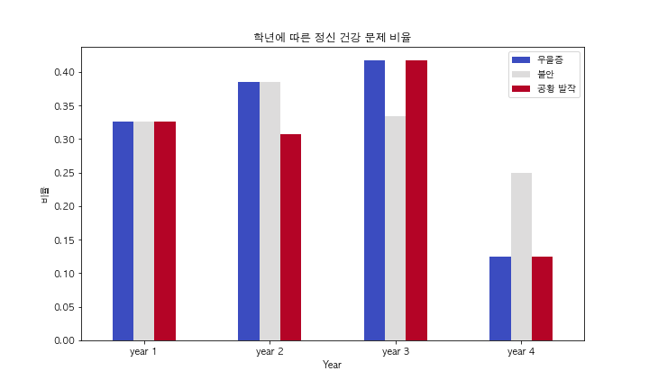

# 🧠 Mental Health Data for U.S. College Students

[](https://www.python.org/)

## 🔍 소개

**Mental Health Data for U.S. College Students** 프로젝트는 대학생을 대상으로 한 정신건강 설문 데이터를 분석하여  
성별, 연령, 학년 등에 따른 정신건강 관련 분포와 특성을 시각화하는 프로젝트입니다.

---

## 🧪 분석 방법

- 데이터 불러오기 및 결측치 처리
- 주요 변수(성별, 나이, 학년) 기준으로 그룹화
- 각 그룹별 응답 비율 및 분포 시각화 (Bar chart, Pie chart 등)
- 시각화 결과는 PNG 이미지로 `result/` 폴더에 저장

---

## 📊 분석 결과 요약

- **성별 분포**: 남성보다 여성이 더 많은 응답을 제출함
- **연령 분포**: 응답자는 대부분 18~24세에 집중됨
- **학년별 분포**: 2학년과 3학년이 가장 많은 비중을 차지함
- **정신건강 관련 설문**: 스트레스를 느끼는 학생 비율이 높고, 심리 상담을 이용한 경험은 상대적으로 적음

---

## 📈 시각화 예시

### ▶️ 성별 분포


### ▶️ 연령대 분포


### ▶️ 학년별 분포


---

## 📁 프로젝트 구조

```
📁 Mental_Health_Data_for_US_College_Students-master/
│
├── 📁 data/
│   └── Student Mental health.csv       # 대학생 정신건강 설문 원본 데이터
│
├── 📁 result/
│   ├── age.png                         # 연령대별 시각화
│   ├── gender.png                      # 성별 분포 시각화
│   ├── year.png                        # 학년별 시각화
│   └── .gitignore
│
└── student.py                          # 데이터 분석 및 시각화 코드
```

---

## 🚀 실행 방법

### 1. 환경 구성

```bash
python -m venv venv
source venv/bin/activate
pip install -r requirements.txt  # (필요 시 수동 생성)
```

### 2. 실행

```bash
python student.py
```

결과 그래프는 `result/` 폴더에 `.png` 파일로 저장됩니다.

---

## 📌 분석 대상 변수

- 나이 (Age)
- 성별 (Gender)
- 학년 (Year of Study)
- 학업 스트레스, 정신 건강 상담 이용 여부 등

---

## 🧑‍💻 기여 방법

1. 이 저장소를 포크하세요.
2. 새로운 브랜치를 만드세요: `git checkout -b feature/새기능`
3. 변경사항을 커밋하세요: `git commit -m "Add 새기능"`
4. 브랜치에 푸시하세요: `git push origin feature/새기능`
5. Pull Request를 생성하세요.

